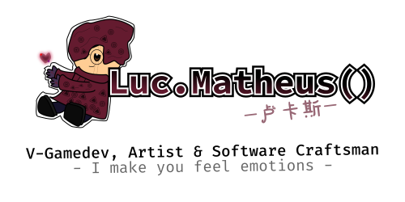

  
Eae, tudo na boa? Chamo-me Lucas Matheus, mas sou conhecido como "Luc" aqui na internet, apenas um humilde e dedicado gamedev/artista autonômo de Belém-PA (Norte do Brasil) que gosta de _retro-games_ e pixelarte, aqui você confere meus mini-projetos, fique a vontade.  
 
Atualmente construindo o *Sorrows* e a minha carreira.
## Site
  _Site temporário em breve_
## Mídias sociais
    
## Linguagens de programação & Game Engines
* PHP
* Java
* Javascript
* Python
* C/C++
---
* Godot
* RPG Maker 2K/2K3/XP

## Idiomas
*  Português(Brasil)
*  English
*  Espanhol (loading...)
*  汉语 (loading...)
*  日本語 (loading...)